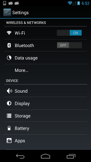

# ::Android UI Automator::

[**`Anroid UI Automator`**](res/Android-UI-Automator.htm)是一个Android平台跨应用程序功能性的UI测试框架。

它是Google原生测试框架，这个框架提供三个主要功能：

   * uiautomatorviewer
   * 访问设备API
   * 访问UI组件API

**Notes**: 本文档所用的的软件依赖[**`Android Command Line Tools`**](res/Android-Command-Line-Tools.htm)，请提前[**`下载`**](res/下载AndroidStudio和SDK工具.htm).

## 1. uiautomatorviewer

uiautomatorviewer 工具提供了一个方便的 GUI，可以扫描和分析 Android 设备上当前显示的 UI 组件。您可以使用此工具检查布局层次结构，并查看在设备前台显示的 UI 组件属性。利用此信息，您可以使用 UI Automator创建控制更加精确的测试。

uiautomatorviewer 工具位于**android-sdk**/tools/目录中：

    $ cd android-sdk/tools/
    $ ./uiautomatorviewer
    
你也可以把uiautomatorviewer的路径加到PATH环境变量中，这样你可以直接在命令行输入uiautomatorviewer，就可以打开这个工具

    $ uiautomatorviewer

下面是这个工具的样子：


左边是手机的当前界面的截屏，右边是控件信息。移动鼠标到某个控件上时，红色的框会抓住该控件，并在右边显示详细的信息。

## 2. 访问设备的API

UI Automator 测试框架提供了个UiDevice类，用于访问Android设备属性和执行操作，例如：

- 旋转手机屏幕
- 按Home键，按Back键
- 打开通知栏
- 截屏

一些常用方法：

| Return | Function | Summary |
| ------ |-------| ----------------------|
| boolean | click(int x, int y) | Perform a click at arbitrary coordinates specified by the user |
| boolean | pressBack() | Simulates a short press on the BACK button |
| boolean | pressHome() | Simulates a short press on the HOME button |
| boolean | takeScreenshot(File storePath, float scale, int quality) | Take a screenshot of current window and store it as PNG The screenshot is adjusted per screen rotation |

更多方法，请看[**`UiDevice`**](res/Android-UiDevice-Class.htm)类。


## 3. 访问UI组件的API

通过访问UI组件的API，可以编写稳健可靠的测试，而无需了解目标应用的实现详情。以下就是UI组件的API，您可以使用这些API在多个应用中捕获和操作UI组件：

- UiCollection：枚举容器的 UI 元素以便计算子元素个数，或者通过可见的文本或内容描述属性来指代子元素。
- UiObject：表示设备上可见的 UI 元素。
- UiScrollable：为在可滚动 UI 容器中搜索项目提供支持。
- UiSelector：表示在设备上查询一个或多个目标 UI 元素。
- Configurator：允许您设置运行 UI Automator 测试所需的关键参数。

**Notes**: 这里不具体讨论这些API，在下面的python中 uiautomator包介绍中会用到这些API, 会有详细例子。

# ::Android UI Automator 原生框架缺点以更好的方案::
原生框架时用的java写的，自然而然最先想到是用java去写测试脚本，但是在编写过程中发现问题：

- 编译，运行的步骤复杂，每次改好脚本，还得push到手机里去。
- 使用笨重的JAVA语言，很多语法不够便捷

有没有更好的方案？有

用Python写测试脚本，不仅有原生框架的优点，也解决了java语言一些缺点，更快更好维护测试代码。
用Python写android平台测试脚本，用到一个python包 ，叫“uiautomator”，它来至于github开源社区[**`https://github.com/xiaocong/uiautomator`**](https://github.com/xiaocong/uiautomator)

下面讲详细介绍这个Python中uiautomator包,打住，介绍开始前我们先看看需要安装什么环境
# ::安装环境::
1. **安装python**：

    推荐安装python 2.7版本的，我觉得这个版本最稳定，自己电脑是python3也可以，windows系统可以去[**`Python官网下载`**](https://www.python.org/)下载安装，Mac电脑自带python就可以，如果我没记错的话，Ubuntu也是自带python

2.  **安装pip**：
	首先下载[**`get-pip.py`**](res/get-pip.py)脚本，这里我已经下好了，点击链接就可以获取，完成后

        $ cd get-pip.py目录下
        $ python get-pip.py
   更新pip，
   On Linux or macOS:
   
        $pip install -U pip
        
   On Windows :

        $python -m pip install -U pip
	

   如果以上还不能帮助你安装pip，请去[**`pip官网`**](https://pip.pypa.io/en/stable/installing/)看更多信息。

3.  **安装uiautomator包**：

    直接在命令行输入如下命令，如果提示找不到，请把pip的路径加到环境变量PATH中，特别是在windows上系统上至下命令。

        $ pip install uiautomator
        
       

     以上三部完成后，我们可以验证下，
     直接在命令行输入python，进入到python命令交互行

        $ python
     接着导入uiautomator包,没有任何提示，就是成功了

        >>> from uiautomator import Device
        >>>

4.  **不要忘记Android-ADB**：

    在文档开头的Notes中就说过，需要[**`Android Command Line Tools`**](res/Android-Command-Line-Tools.htm)，它里面包含Android开发和测试用的所有软件，其中就有Android ADB软件，不知道不会Android ADB[**`请点击`**](res/Android-ADB.htm)。

    如果安装成功，输入如下命令，就可以看到adb帮助信息：

        $ adb
        
# ::Python中uiautomator包::

This module is a Python wrapper of Android UI Automator testing framework. It works on Android 4.1+ simply with Android device attached via adb, no need to install anything on Android device.

    $ adb deivces
    #得到设备串口号
    $ python
    >>> from uiautomator import Device
    >>> d=Device("Android设备串口号")
    >>> d(text="Phone").click()

在Mac电脑上的实际操作如下：


结果如下, 点击"Phone" icon, Launch Phone APP:


<!--### import uiautomator

- If `ANDROID_SERIAL` is defined in environment, or there is only one device connected:

  ```python
  from uiautomator import device as d
  ```

- Speficy the serial number when retrieving the device object

  ```python
  from uiautomator import Device

  d = Device('014E05DE0F02000E')
  ```
-->
**Notes**: In below examples, we use `d` represent the android device object.

## 1. Basic API Usages

This part show the normal actions of the device through some simple examples.

* Retrieve the device info

  ```python
  d.info
  ```

  Below is a possible result:

  ```
  { u'displayRotation': 0,
    u'displaySizeDpY': 640,
    u'displaySizeDpX': 360,
    u'currentPackageName': u'com.android.launcher',
    u'productName': u'takju',
    u'displayWidth': 720,
    u'sdkInt': 18,
    u'displayHeight': 1184,
    u'naturalOrientation': True
  }
  ```

## 2. Key Event Actions of the device

* Turn on/off screen

  ```python
  # Turn on screen
  d.screen.on()
  # Turn off screen
  d.screen.off()
  ```

  Alternative method is:

  ```python
  # wakeup the device
  d.wakeup()
  # sleep the device, same as turning off the screen.
  d.sleep()
  ```

* Check if the screen is on or off

    ```python
    if d.screen == "on":  # of d.screen != "off"
        # do something in case of screen on
        pass
    if d.screen == "off":  # of d.screen != "on"
        # do something in case of screen off
        pass
    ```

* Press hard/soft key
  
  
  

  ```python
  # press home key
  d.press.home()
  # press back key
  d.press.back()
  # the normal way to press back key
  d.press("back")
  # press keycode 0x07('0') with META ALT(0x02) on
  d.press(0x07, 0x02)
  ```

* Next keys are currently supported:

  - `home`
  - `back`
  - `left`
  - `right`
  - `up`
  - `down`
  - `center`
  - `menu`
  - `search`
  - `enter`
  - `delete`(or `del`)
  - `recent`(recent apps)
  - `volume_up`
  - `volume_down`
  - `volume_mute`
  - `camera`
  - `power`

  You can find all key code definitions at [**`Android KeyEvent`**](res/Android-KeyEvent.htm).

### Gesture interaction of the device

* Click the screen

  

  ```python
  # click (x, y) on screen
  d.click(x, y)
  ```

* Long click the screen

  

  ```python
  # long click (x, y) on screen
  d.long_click(x, y)
  ```

* Swipe

  

  ```python
  # swipe from (sx, sy) to (ex, ey)
  d.swipe(sx, sy, ex, ey)
  # swipe from (sx, sy) to (ex, ey) with 10 steps
  d.swipe(sx, sy, ex, ey, steps=10)
  ```

* Drag

  

  ```python
  # drag from (sx, sy) to (ex, ey)
  d.drag(sx, sy, ex, ey)
  # drag from (sx, sy) to (ex, ey) with 10 steps
  d.drag(sx, sy, ex, ey, steps=10)
  ```

## 3. Screen Actions of the device

* Retrieve/Set Orientation

  The possible orientation is:
  -   `natural` or `n`
  -   `left` or `l`
  -   `right` or `r`
  -   `upsidedown` or `u` (can not be set)

  ```python
  # retrieve orientation, it may be "natural" or "left" or "right" or "upsidedown"
  orientation = d.orientation
  # set orientation and freeze rotation.
  # notes: "upsidedown" can not be set until Android 4.3.
  d.orientation = "l" # or "left"
  d.orientation = "r" # or "right"
  d.orientation = "n" # or "natural"
  ```

* Freeze/Un-Freeze rotation

  ```python
  # freeze rotation
  d.freeze_rotation()
  # un-freeze rotation
  d.freeze_rotation(False)
  ```

* Take screenshot

  ```python
  # take screenshot and save to local file "home.png", can not work until Android 4.2.
  d.screenshot("home.png")
  ```

* Dump Window Hierarchy

  ```python
  # dump the widown hierarchy and save to local file "hierarchy.xml"
  d.dump("hierarchy.xml")
  # or get the dumped content(unicode) from return.
  xml = d.dump()
  ```

* Open notification or quick settings

 
 

  ```python
  # open notification, can not work until Android 4.3.
  d.open.notification()
  # open quick settings, can not work until Android 4.3.
  d.open.quick_settings()
  ```

* Wait for idle or window update

  ```python
  # wait for current window to idle
  d.wait.idle()
  # wait until window update event occurs
  d.wait.update()
  ```

## 4. Watcher

You can register [**`watcher`**](res/UiWatcher-Class.htm) to perform some actions when a selector can not find a match.


* Register Watcher

  When a selector can not find a match, uiautomator will run all registered watchers.

  - Click target when conditions match

  ```python
  d.watcher("AUTO_FC_WHEN_ANR").when(text="ANR").when(text="Wait") \
                               .click(text="Force Close")
  # d.watcher(name) ## creates a new named watcher.
  #  .when(condition)  ## the UiSelector condition of the watcher.
  #  .click(target)  ## perform click action on the target UiSelector.
  ```

  - Press key when conditions match

  ```python
  d.watcher("AUTO_FC_WHEN_ANR").when(text="ANR").when(text="Wait") \
                               .press.back.home()
  # Alternative way to define it as below
  d.watcher("AUTO_FC_WHEN_ANR").when(text="ANR").when(text="Wait") \
                               .press("back", "home")
  # d.watcher(name) ## creates a new named watcher.
  #  .when(condition)  ## the UiSelector condition of the watcher.
  #  .press.<keyname>.....<keyname>.()  ## press keys one by one in sequence.
  #  Alternavie way defining key sequence is press(<keybname>, ..., <keyname>)
  ```

* Check if the named watcher triggered

  A watcher is triggered, which means the watcher was run and all its conditions matched.

  ```python
  d.watcher("watcher_name").triggered
  # true in case of the specified watcher triggered, else false
  ```

* Remove named watcher

  ```python
  # remove the watcher
  d.watcher("watcher_name").remove()
  ```

* List all watchers

  ```python
  d.watchers
  # a list of all registered wachers' names
  ```

* Check if there is any watcher triggered

  ```python
  d.watchers.triggered
  #  true in case of any watcher triggered
  ```

* Reset all triggered watchers

  ```python
  # reset all triggered watchers, after that, d.watchers.triggered will be false.
  d.watchers.reset()
  ```

* Remvoe watchers

  ```python
  # remove all registered watchers
  d.watchers.remove()
  # remove the named watcher, same as d.watcher("watcher_name").remove()
  d.watchers.remove("watcher_name")
  ```

* Force to run all watchers

  ```python
  # force to run all registered watchers
  d.watchers.run()
  ```

## 5. Handler

The functionality of handler is same as Watcher, except it is implemented ourside of Android uiautomator. The most different usage between handler and watcher is, handler can use customized callback function.

```python
def fc_close(device):
  if device(text='Force Close').exists:
    device(text='Force Close').click()
  return True  # return True means to break the loop of handler callback functions.

# turn on the handler callback function
d.handlers.on(fc_close)

# turn off the handler callback function
d.handlers.off(fc_close)
```

## 6. Selector

Selector is to identify specific ui object in current window.

```python
# To seleted the object ,text is 'Clock' and its className is 'android.widget.TextView'
d(text='Clock', className='android.widget.TextView')
```

Selector supports below parameters. Refer to [**UiSelector**](res/UiSelector-Class.htm) for detailed information.

*  `text`, `textContains`, `textMatches`, `textStartsWith`
*  `className`, `classNameMatches`
*  `description`, `descriptionContains`, `descriptionMatches`, `descriptionStartsWith`
*  `checkable`, `checked`, `clickable`, `longClickable`
*  `scrollable`, `enabled`,`focusable`, `focused`, `selected`
*  `packageName`, `packageNameMatches`
*  `resourceId`, `resourceIdMatches`
*  `index`, `instance`

## 7. Child and sibling UI object

* child

  ```python
  # get the child or grandchild
  d(className="android.widget.ListView").child(text="Bluetooth")
  ```

* sibling

  ```python
  # get sibling or child of sibling
  d(text="Google").sibling(className="android.widget.ImageView")
  ```

* child by text or description or instance

  ```python
  # get the child match className="android.widget.LinearLayout"
  # and also it or its child or grandchild contains text "Bluetooth"
  d(className="android.widget.ListView", resourceId="android:id/list") \
   .child_by_text("Bluetooth", className="android.widget.LinearLayout")

  # allow scroll search to get the child
  d(className="android.widget.ListView", resourceId="android:id/list") \
   .child_by_text(
      "Bluetooth",
      allow_scroll_search=True,
      className="android.widget.LinearLayout"
    )
  ```

  - `child_by_description` is to find child which or which's grandchild contains
      the specified description, others are the same as `child_by_text`.

  - `child_by_instance` is to find child which has a child UI element anywhere
      within its sub hierarchy that is at the instance specified. It is performed
      on visible views without **scrolling**.

  See below links for detailed information:

  -   [**`UiScrollable`**](res/UiScrollable-Class.htm), `getChildByDescription`, `getChildByText`, `getChildByInstance`
  -   [**`UiCollection`**](res/UiCollection-Class.htm), `getChildByDescription`, `getChildByText`, `getChildByInstance`

  Above methods support chained invoking, e.g. for below hierarchy

  ```xml
  <node index="0" text="" resource-id="android:id/list" class="android.widget.ListView" ...>
    <node index="0" text="WIRELESS & NETWORKS" resource-id="" class="android.widget.TextView" .../>
    <node index="1" text="" resource-id="" class="android.widget.LinearLayout" ...>
      <node index="1" text="" resource-id="" class="android.widget.RelativeLayout" ...>
        <node index="0" text="Wi‑Fi" resource-id="android:id/title" class="android.widget.TextView" .../>
      </node>
      <node index="2" text="ON" resource-id="com.android.settings:id/switchWidget" class="android.widget.Switch" .../>
    </node>
    ...
  </node>
  ```
  

  We want to click the switch at the right side of text 'Wi‑Fi' to turn on/of Wi‑Fi.
  As there are several switches with almost the same properties, so we can not use like
  `d(className="android.widget.Switch")` to select the ui object. Instead, we can use
  code below to select it.

  ```python
  d(className="android.widget.ListView", resourceId="android:id/list") \
    .child_by_text("Wi‑Fi", className="android.widget.LinearLayout") \
    .child(className="android.widget.Switch") \
    .click()
  ```

* relative position

  Also we can use the relative position methods to get the view: `left`, `right`, `top`, `bottom`.

  -   `d(A).left(B)`, means selecting B on the left side of A.
  -   `d(A).right(B)`, means selecting B on the right side of A.
  -   `d(A).up(B)`, means selecting B above A.
  -   `d(A).down(B)`, means selecting B under A.

  So for above case, we can write code alternatively:

  ```python
  ## select "switch" on the right side of "Wi‑Fi"
  d(text="Wi‑Fi").right(className="android.widget.Switch").click()
  ```

* Multiple instances

  Sometimes the screen may contain multiple views with the same e.g. text, then you will
  have to use "instance" properties in selector like below:

  ```python
  d(text="Add new", instance=0)  # which means the first instance with text "Add new"
  ```

  However, uiautomator provides list like methods to use it.

  ```python
  # get the count of views with text "Add new" on current screen
  d(text="Add new").count

  # same as count property
  len(d(text="Add new"))

  # get the instance via index
  d(text="Add new")[0]
  d(text="Add new")[1]
  ...

  # iterator
  for view in d(text="Add new"):
      view.info  # ...
  ```

  **Notes**: when you are using selector like a list, you must make sure the screen
  keep unchanged, else you may get ui not found error.

## 8. Get the selected ui object status and its information

* Check if the specific ui object exists

  ```python
  d(text="Settings").exists # True if exists, else False
  d.exists(text="Settings") # alias of above property.
  ```

* Retrieve the info of the specific ui object

  ```python
  d(text="Settings").info
  ```

  Below is a possible result:

  ```
  { u'contentDescription': u'',
    u'checked': False,
    u'scrollable': False,
    u'text': u'Settings',
    u'packageName': u'com.android.launcher',
    u'selected': False,
    u'enabled': True,
    u'bounds': {u'top': 385,
                u'right': 360,
                u'bottom': 585,
                u'left': 200},
    u'className': u'android.widget.TextView',
    u'focused': False,
    u'focusable': True,
    u'clickable': True,
    u'chileCount': 0,
    u'longClickable': True,
    u'visibleBounds': {u'top': 385,
                       u'right': 360,
                       u'bottom': 585,
                       u'left': 200},
    u'checkable': False
  }
  ```
* Set/Clear text of editable field

  ```python
  d(text="Settings").clear_text()  # clear the text
  d(text="Settings").set_text("My text...")  # set the text
  ```

#### Perform the click action on the seleted ui object

* Perform click on the specific ui object

  ```python
  # click on the center of the specific ui object
  d(text="Settings").click()
  # click on the bottomright corner of the specific ui object
  d(text="Settings").click.bottomright()
  # click on the topleft corner of the specific ui object
  d(text="Settings").click.topleft()
  # click and wait until the new window update
  d(text="Settings").click.wait()
  ```

* Perform long click on the specific ui object

  ```python
  # long click on the center of the specific ui object
  d(text="Settings").long_click()
  # long click on the bottomright corner of the specific ui object
  d(text="Settings").long_click.bottomright()
  # long click on the topleft corner of the specific ui object
  d(text="Settings").long_click.topleft()
  ```

#### Gesture action for the specific ui object

* Drag the ui object to another point or ui object 

  ```python
  # notes : drag can not be set until Android 4.3.
  # drag the ui object to point (x, y)
  d(text="Settings").drag.to(x, y, steps=100)
  # drag the ui object to another ui object(center)
  d(text="Settings").drag.to(text="Clock", steps=50)
  ```

* Swipe from the center of the ui object to its edge

  Swipe supports 4 directions:

  -   `left`
  -   `right`
  -   `top`
  -   `bottom`

  ```python
  d(text="Settings").swipe.right()
  d(text="Settings").swipe.left(steps=10)
  d(text="Settings").swipe.up(steps=10)
  d(text="Settings").swipe.down()
  ```

* Two point gesture from one point to another

  ```python
  d(text="Settings").gesture((sx1, sy1), (sx2, sy2)) \
                    .to((ex1, ey1), (ex2, ey2))
  ```

* Two point gesture on the specific ui object

  Supports two gestures:
  - `In`, from edge to center
  - `Out`, from center to edge

  ```python
  # notes : pinch can not be set until Android 4.3.
  # from edge to center. here is "In" not "in"
  d(text="Settings").pinch.In(percent=100, steps=10)
  # from center to edge
  d(text="Settings").pinch.Out()
  ```

* 3 point gesture

  ```python
  d().gestureM((sx1, sy1), (sx2, sy2),(sx3, sy3)) \
                    .to((ex1, ey1), (ex2, ey2),(ex3,ey3))
  d().gestureM((100,200),(300,200),(600,200),(100,600),(300,600),(600,900))
  ```

* Wait until the specific ui object appears or gone

  ```python
  # wait until the ui object appears
  d(text="Settings").wait.exists(timeout=3000)
  # wait until the ui object gone
  d(text="Settings").wait.gone(timeout=1000)
  ```

* Perform fling on the specific ui object(scrollable)

  Possible properties:
  - `horiz` or `vert`
  - `forward` or `backward` or `toBeginning` or `toEnd`

  ```python
  # fling forward(default) vertically(default) 
  d(scrollable=True).fling()
  # fling forward horizentally
  d(scrollable=True).fling.horiz.forward()
  # fling backward vertically
  d(scrollable=True).fling.vert.backward()
  # fling to beginning horizentally
  d(scrollable=True).fling.horiz.toBeginning(max_swipes=1000)
  # fling to end vertically
  d(scrollable=True).fling.toEnd()
  ```

* Perform scroll on the specific ui object(scrollable)

  Possible properties:
  - `horiz` or `vert`
  - `forward` or `backward` or `toBeginning` or `toEnd`, or `to`

  ```python
  # scroll forward(default) vertically(default)
  d(scrollable=True).scroll(steps=10)
  # scroll forward horizentally
  d(scrollable=True).scroll.horiz.forward(steps=100)
  # scroll backward vertically
  d(scrollable=True).scroll.vert.backward()
  # scroll to beginning horizentally
  d(scrollable=True).scroll.horiz.toBeginning(steps=100, max_swipes=1000)
  # scroll to end vertically
  d(scrollable=True).scroll.toEnd()
  # scroll forward vertically until specific ui object appears
  d(scrollable=True).scroll.to(text="Security")
  ```

<!--## Issues & Discussion

If you have any bug reports or annoyances please report them to our issue tracker at [github issues][].-->
## Notes

- [**`Anroid UI Automator`**](res/Android-UI-Automator.htm) works on Android 4.1+, so before using it, make sure your device is Android4.1+.
- Some methods are only working on Android 4.2/4.3, so you'd better read detailed [**`documentation of uiautomator`**](res/测试支持库.htm) before using it.
- The module uses [**`uiautomator-jsonrpc-server`**](https://github.com/xiaocong/android-uiautomator-server) as its daemon to communicate with devices.
- The module is only tested on python2.7/3.2/3.3/pypy.

## FAQ

- Could not start JSONRPC server: `raise IOError("RPC server not started!")`

    It may be caused by network, device, or environment. So when you meet the issue, please follow below steps and try to manually start the JSONRPC server.

    1. Follow steps at [**`uiautomator-jsonrpc-server`**](https://github.com/xiaocong/android-uiautomator-server#build) to start jsonrpc server.

    2. Check if jsonrpc server is ok:

            curl -d '{"jsonrpc":"2.0","method":"deviceInfo","id":1}' localhost:9008/jsonrpc/0

        If you see message like `{"jsonrpc":"2.0","id":1,"result":{"currentPackageName":"android","displayHeight":1280,"displayRotation":0,"displaySizeDpX":0,"displaySizeDpY":0,"displayWidth":720,"productName":"falcon","sdkInt":17,"naturalOrientation":true}}`, it means the server is up.

    If you can manually start the jsonrpc server, but your script always meets `IOError("RPC server not started!")`, please submit an issue at **github issues**.

- Error `httplib.BadStatusLine: ''`

    JsonRPC server needs to access temp directory on device, but on some low tier devices, it may meet error during accessing temp files without SD-CARD attached. So if you met the error, please insert a SD-CARD and then try again.


[uiautomator]: http://developer.android.com/tools/testing/testing_ui.html "Android ui testing"
[github issues]: https://github.com/xiaocong/uiautomator/issues